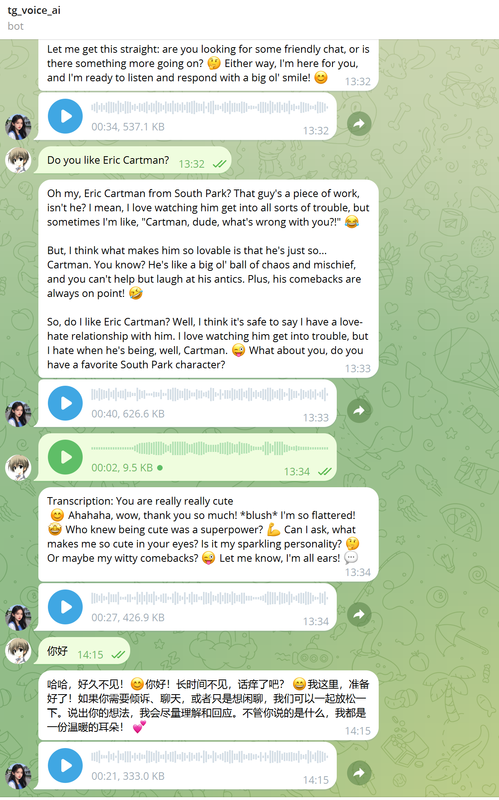

# **电报语音对话机器人**

## **使用方法**

### 我部署的

https://t.me/tg_voice_ai_bot
可以直接使用

### 自己部署

1. 在 botfather 创建机器人
2. 部署 cf 程序

   ```sh
   npm install
   wrangler login # 登录cf
   npm run deploy
   ```

3. cf 配置环境变量 tg_token 和 siliconflow_token（用于生成语音，因为 workers ai 没有 tts 功能）
4. 访问 worker 域名/init 进行电报 webhook 注册

5. 与机器人聊天，支持语音和文字
6. 可以在代码中修改使用模型

   ```ts
   const WHISPER_MODEL = '@cf/openai/whisper'; // Whisper 模型路径
   const CHAT_MODEL = '@cf/meta/llama-2-7b-chat-int8'; // Llama 模型路径
   const TTS_MODEL = 'RVC-Boss/GPT-SoVITS'; // Whisper 模型路径
   ```

## 演示


